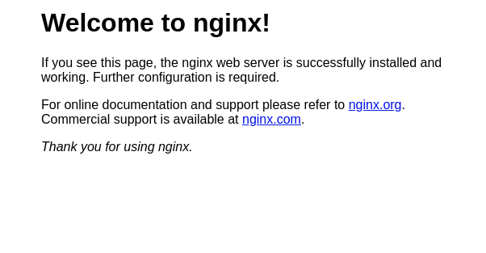
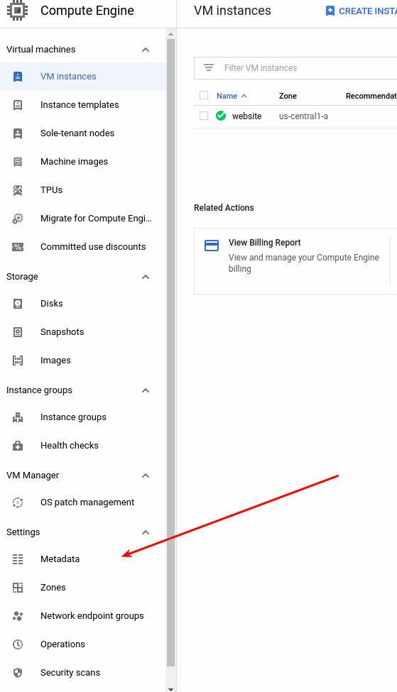
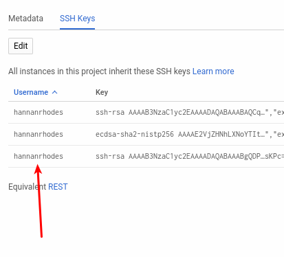
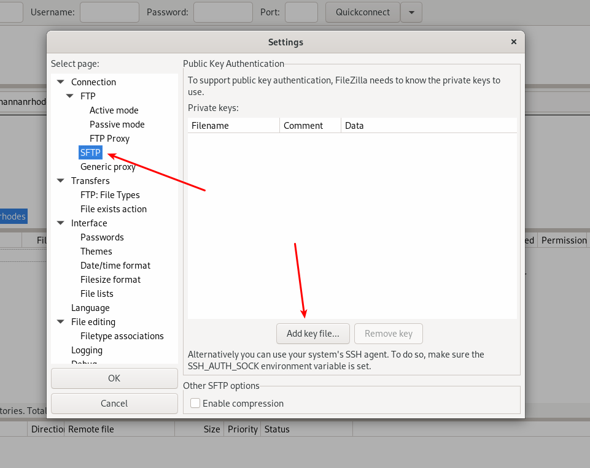

Welcome to the DSC and ACM intro to website hosting event!

This document is meant to be worked/read through during one of our workshops, but we made sure it's possible to learn in your comfortable and socially removed home.

# Topics


1. Clone this repo
2. Making your website.
3. Creating your server.
4. Installing NGINX on your server.
5. Uploading your html to your server.
   1. (optional) Connecting via SSH and SFTP
6. Add to DNS.


## Clone this repo

As you can most likely tell by the website you're on, we use git to manage, distribute, and version control our code. In summary "Git is a free and open source distributed version control system designed to handle everything from small to very large projects with speed and efficiency. "

The very first step you should take in this workshop is copy the code locally to your computer. There are two ways you can do this, by just downloading it through your browser, or through your terminal. 

### Through Browser

Go to this workshop's [github repo](https://github.com/dsc-umass/dsc-serverhosting-event) and look for the green button on the top right that says `Code`. 
Click on it and select the download zip, 
then decompress it in the workspace folder of your choice. 

### Through Terminal

If you already have [git](https://git-scm.com/) installed. Great! If not, then we do recommend downloading it [here](https://git-scm.com/).

Once downloaded, open up your terminal and `cd` into your preferred workspace and enter 
```bash 
git clone https://github.com/dsc-umass/dsc-serverhosting-event.git
```

## Making your website.

Now its time for the creative part.

Select your favorite text editor and open the index.html file. 

There are 5 places you will insert some cool customization that we provide, but of course, this is your website and should play around the html code. Change some colors, fonts, or add text of your liking, change up some hex colors for fun. I don't know, this is your website!
Go to line 10, 13, 45, 51, 58.

## Creating your server.

Now your speaker/lecturer will help you through this process.

## Installing NGINX on your server.

Because we are using Ubuntu server as out OS of choice it allows us to use the apt package manager.
Think of apt like the app store of ubuntu servers.

Enter `sudo apt-get install nginx` into your terminal on your server and press y when prompted to install nginx. 

Once installed, it should automatically run nginx and take care of most maintenance, such as starting it on boot and starting the software.
If you really want to check if its running, type in 
```bash 
sudo systemctl status nginx
```

And now you have an active server hosting files on your server... just not the files you want. To test if it actually works, enter the IP of your server into your browser, and you should see something like this.


It may not look like it now, but it is serving an html file.

## Uploading your html to your server.

Now time to upload your incredible masterpiece onto your own server to share with the world.

On a normal nginx installation, the website is stored in the directory `/var/www/html`. 

If you go there your self using `cd /var/www/html`, you will see the `index.nginx-debian.html` file thats currently serving as the nginx welcome page.

Delete that file with 
```bash 
sudo rm index.nginx-debian.html
```
 and create a new file called `index.html`. Put your website code into there by running 
 ```bash
 sudo nano index.html
 ```
pasting your code, then saving by pressing ctrl + x, then y. 

This is telling the text editor, nano, that you want to exit then save the file, which in turns creates a file with the code you just typed.


Now go back to the browser and refresh the page. 

You will now see your very own website that you can share with the world!

### Uploading files via SFTP

You're a student who took their time to come to a DSC workshop, or take time to make it this far down the README. I can tell you are someone who wants the learn the real way, the right way to do things.

Here, we will go over the industry standard of access and sharing files through a server.

First thing we need it to create a SSH key. Imagine it as a pair of key(private) and verification(public) for getting into a house. You stand in front of the house making sure no one comes in thats not allowed. Once someone comes up to you, you ask for verification to see if they are allowed in (public key). If it does past your verification, you then take your key(private) and use it to open the door, letting the person inside.

First step is to open up your terminal, these steps should work for windows, linux, and mac users alike.

Type in `ssh-keygen` in your terminal. You can go through the steps, but leaving everything default works perfectly fine.

This will generate 2 important files in the directory the terminal specified the files were saved in.
In my case, it was in my home directory, under /.ssh.

Go into there and open the `id_rsa.pub` public key that you're gonna share with your server.


Now go into the MetaData tab on the GCP section.
 and select the ssh keys tab and paste the contents of your .pub file. This now tells the server you are allowed to access it if you have the correct private key.

*Before you move on*

Make sure you take note of the username of your ssh key. You should be able to see it under the username column.




#### Accessing the servers files

The standard protocol used to share files between computer and server is called FTP (File Transfer Protocol).

And to connect to the server, we will be using [FileZilla](https://filezilla-project.org/), a great open source tried and tested FTP client that enables you to connect to your server's file system and browse.

Download it, then open it up.

First step is to show filezilla what key to use for authentications and where it is.

Go to, `Edit -> Settings` and a window will pop up. On the left hand, select the SFTP tap and add the id_rsa  key file. Not the pub file, the private file.



Now enter in the host field, `sftp://YOUR-SERVER-IP`, and the username used in your key, and connect.

The server directory will come up in the right side of the window and you are able to adventure and manipulate as many files as you like. 

To add files to the web directory, just navigate to the `/var/www/html` directory and any files you drag into the window, such as html, css, and js files will be hosted and served.

<!-- Now there are two paths you can go. For ease of time we will just be replacing the contents in this file with yours, but if you want to do it the official way, you must create a new config for your site.

### (optional) Create config

Instead of changing the file already in the html directory, create a new file called `index.html` and put your website code into there by running `sudo nano index.html`, pasting your code, then saving by pressing ctrl + x, then y. 

This is telling the text editor, nano, that you want to exit then save the file. -->